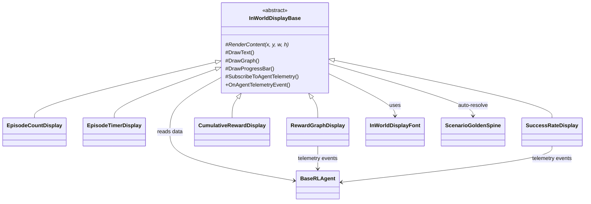

# InWorldDisplay 共通部品リファレンス

> `Assets/_RLMovie/Common/Scripts/InWorldDisplay/`

---

## コンセプト

学習情報をシーン内のオブジェクト（モニター、看板、ビルボード等）のテクスチャとして描画する共通部品群。  
**環境のビジュアルに溶け込む**ことが設計の核心。

```
┌─────────────────────────┐
│  シナリオ環境            │
│  ┌───────┐  ┌───────┐   │
│  │モニター│  │  看板  │   │   ← Quad/Plane等のRenderer
│  │ 1,247 │  │  78%  │   │   ← InWorldDisplay が Texture2D を描画
│  └───────┘  └───────┘   │
│     ↑ EpisodeCount   ↑ SuccessRate
└─────────────────────────┘
```

---

## ファイル構成

| ファイル | 役割 |
|---|---|
| `InWorldDisplayFont.cs` | 5×7ビットマップフォント（数字・英大文字・記号） |
| [InWorldDisplayBase.cs](file:///c:/rl-movie/AI-RL-Movie/Assets/_RLMovie/Common/Scripts/InWorldDisplay/InWorldDisplayBase.cs) | 基底クラス（テクスチャ生成・描画API・自動解決・テレメトリ購読） |
| `EpisodeCountDisplay.cs` | 総試行回数を大きな数字で表示 |
| `EpisodeTimerDisplay.cs` | 試行内ステップ進行度（プログレスバー + 残りステップ） |
| [RewardGraphDisplay.cs](file:///c:/rl-movie/AI-RL-Movie/Assets/_RLMovie/Common/Scripts/InWorldDisplay/RewardGraphDisplay.cs) | 報酬履歴の折れ線グラフ |
| `CumulativeRewardDisplay.cs` | 現在の累計報酬（正=緑、負=赤） |
| [SuccessRateDisplay.cs](file:///c:/rl-movie/AI-RL-Movie/Assets/_RLMovie/Common/Scripts/InWorldDisplay/SuccessRateDisplay.cs) | 直近N回の成功率（% + バー） |

---

## 使い方

### 基本（3ステップ）

1. **Quadを作成** – シーン内のモニター面や看板面として配置
2. **コンポーネントを追加** – 例: `EpisodeCountDisplay` をアタッチ
3. **完了** – Agent は GoldenSpine から自動解決。テクスチャは Renderer に自動適用

### 環境テーマ別の使い分け例

| 環境 | 表示オブジェクト | 設定 |
|---|---|---|
| 研究施設 | モニターQuad | `useEmission=true`（自発光）, `filterMode=Point`（ドット風） |
| 森林 | 木製看板Plane | `useEmission=false`, `filterMode=Bilinear`（滑らか）, 暖色系カラー |
| サイバー空間 | 浮遊パネル | `useEmission=true`, `emissionIntensity=2.0`, アクセント色をネオンに |

### ラベル（オプション）

```
showLabel = false   → 数値のみ（デフォルト・推奨）
showLabel = true    → 上部に小さくラベルテキスト表示
labelText = "EPISODES"
```

---

## カスタマイズ

### カラーパレット

全コンポーネント共通で5色をインスペクタから変更可能:

| フィールド | 用途 | デフォルト |
|---|---|---|
| `backgroundColor` | テクスチャ背景 | ダーク (0.05, 0.07, 0.1) |
| `primaryColor` | 通常テキスト | ライト (0.88, 0.93, 1.0) |
| `accentColor` | 正の値・成功 | グリーン (0.2, 0.85, 0.5) |
| `warningColor` | 負の値・危険 | レッド (0.95, 0.35, 0.22) |
| `dimColor` | ラベル・軸線・暗い要素 | グレー (0.22, 0.26, 0.32) |

### Agent バインディング

GoldenSpine 経由で自動解決（`targetAgentRole` / `targetAgentRoles` / `targetAgentTeam`）。  
手動で `targetAgent` をインスペクタ指定も可。

---

## アーキテクチャ



### ポイント

- **データ源とビジュアルの分離**: コンポーネントは Texture2D を生成するだけ。それをどのオブジェクトに貼るかはシナリオ側が決める
- **テレメトリ購読はオプトイン**: 基底の [SubscribeToAgentTelemetry()](file:///c:/rl-movie/AI-RL-Movie/Assets/_RLMovie/Common/Scripts/InWorldDisplay/InWorldDisplayBase.cs#358-367) を呼んだサブクラスだけがイベントを受け取る
- **ヘッドレス無効化**: `RLMovieRuntime.IsHeadless` 時は自動で `enabled = false`（学習中の無駄な描画を防止）
- **新しい表示を追加**: [InWorldDisplayBase](file:///c:/rl-movie/AI-RL-Movie/Assets/_RLMovie/Common/Scripts/InWorldDisplay/InWorldDisplayBase.cs#13-399) を継承して [RenderContent()](file:///c:/rl-movie/AI-RL-Movie/Assets/_RLMovie/Common/Scripts/InWorldDisplay/RewardGraphDisplay.cs#38-62) を実装するだけ
